# Deep Dives — Seven Agentic Systems (with workflow diagrams)

Detailed teardown of seven systems, each with: snapshot · architecture & components · **workflow after a user request (mermaid flowchart)** · decomposition (Q1) · ordering (Q2) · state/memory · where AI/LLM is used (the boundary) · pros & cons · fitment for your build · references.

Covered: **Oracle Data Science Agent · Julius AI · DeepAnalyze-8B · Agno Dash · Airflow 3 + Astronomer Otto · Hermes Agent (Nous) · Omnigent.**

Reminder of the architecture each is graded against:
> user query → intent / ambiguity resolution → **decompose into a plan (Q1)** → **order the tasks (Q2)** → execute → results, with replanning loops.

These span all three tiers: Oracle/Julius/DeepAnalyze/Agno are **data agents (Tier A)**; Airflow/Otto is the **execution backbone (Tier B)**; Hermes and Omnigent are **substrate/governance (Tier C)**.

**Reading the workflow diagrams.** Every node is tagged on two axes so you can see the architecture at a glance:
- **LLM vs no-LLM** — does the step invoke a language model, or is it deterministic/classical execution? Colors: **blue = LLM**, **gray = no-LLM (deterministic)**, **purple = mixed** (an LLM part + a deterministic part), **white = input/output**.
- **fixed vs runtime** — is the step's presence and position hardcoded into the pipeline (*fixed*), or decided dynamically while the agent runs (*runtime*)? A runtime choice made by a person rather than the model is marked *(user)* / *(human)*.

So `(LLM · runtime)` = an LLM call whose path is chosen at runtime; `(no-LLM · fixed)` = a deterministic step that always runs at this position; `(LLM · fixed slot)` = an LLM call that always occupies this slot but whose output is generated; `(mixed · runtime)` = both. Colors are best-effort — some Markdown viewers ignore mermaid styling, so the **text tag in each node is the source of truth**.

Each section has **two diagrams**: a detailed one, and a **compact, slide-friendly version** (left-to-right, granular steps merged into single blocks — e.g. tools/inputs/lifecycle stages collapsed) sized to drop into a PowerPoint slide. The compact tags keep only the LLM axis (LLM / no-LLM / mixed) for legibility.

---

## 1. Oracle Data Science Agent

**Snapshot.** Conversational, in-database data-science agent inside **Oracle Autonomous AI Database 26ai** (Oracle Machine Learning). Covers the full lifecycle — profile → feature-engineer → train → validate → explain — *without moving data out of the database*. One of the very few systems here that actually trains models (not just SQL). Managed; Oracle-DB-bound. Announced March 2026 — at announcement Oracle described it as *planned for release on Autonomous AI Database Serverless 26ai within ~12 months*, so treat it as announced/preview rather than confirmed GA.

**Architecture & components.**
- **Data Science Agent (OML)** — the conversational lifecycle agent, launched from the Oracle Machine Learning UI console.
- **Select AI** (`DBMS_CLOUD_AI`) — the underlying mechanism: you define LLM settings in an **AI profile** and store credentials via `DBMS_CLOUD`; a wide range of AI providers/LLMs is supported. (Select AI also exposes agentic/tool and MCP capabilities for the Autonomous AI Database.)
- **In-DB algorithms** — in-database classification & regression including XGBoost (in 26ai), Support Vector Machine, Generalized Linear Model, and others; classical ML, executed where the data lives.
- **Conversation Objects Catalog** — register the specific tables, views, and mining models the agent may use, to scope access and improve precision/efficiency (governance + keeps planning bounded).

**Workflow after a user request.**

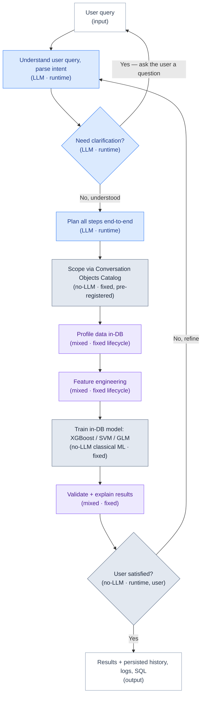

*The clarification loop (ask the user a question → return to the query) is Oracle's **interactive** behavior; in fully **autonomous** mode the agent suppresses the loop and runs straight through ("perform all steps end-to-end and give me the result").*

**Compact view (slide-friendly):**

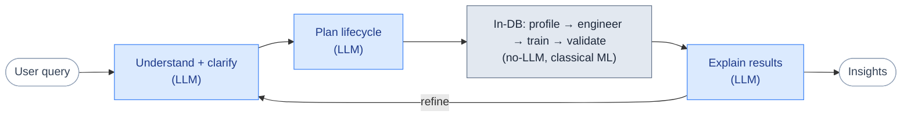

**Decomposition (Q1).** Lifecycle decomposition — the fixed DS skeleton (profile → features → train → evaluate → explain) is broken into steps; interactive mode externalizes the plan for the user to validate before proceeding.

**Ordering (Q2).** Determined by the lifecycle order plus the Conversation Objects Catalog scope. The user can validate interactively, then hand the remaining steps to autonomous execution.

**State / memory.** Persistent conversation history, logs, and SQL snippets for reproducibility, audit, onboarding, and resuming a project later.

**Where AI/LLM is used.** The LLM drives the conversational interface, intent parsing, planning, in-DB SQL/code generation, and result explanation. **Model training itself is classical in-DB ML, not an LLM.** This is the clean separation worth noting: LLM for reasoning + orchestration, classical algorithms for the model.

**Pros.** Genuinely trains+validates models conversationally; data never leaves the DB (governance, security); interactive↔autonomous toggle is a clean ambiguity-resolution pattern. **Cons.** Oracle-DB-bound; very new; algorithm set limited to in-DB options; closed/managed.

**Fitment.** If your "execute the plan" must include model training, this is the strongest commercial proof a conversational planner→executor can own training end-to-end. Copy the **interactive→autonomous escalation** for your ambiguity stage: ask only until confident, then delegate the rest.

**References.** DS Agent — https://blogs.oracle.com/machinelearning/data-science-agent-native-conversational-analytics-and-machine-learning-in-autonomous-ai-database · 26ai — https://blogs.oracle.com/database/oracle-announces-oracle-ai-database-26ai

---

## 2. Julius AI

**Snapshot.** Standalone "AI data scientist" chat + notebook product. Closest single tool to your *full* spec — it writes and runs Python/R, pulls external data, **calls external APIs**, runs full EDA, and trains ML (PyTorch/TensorFlow) inside one session. Commercial; credit-based.

**Architecture & components.**
- **Chat + notebooks** — reusable, parameterized workflow templates (text/data inputs + prompt cells + optional code cells).
- **Custom Agents** — bind data, tools, and a knowledge base; set per-agent output preferences.
- **Scheduled Runs**, **Slack agent**, **warehouse connectors** (Snowflake, BigQuery, Postgres, Drive/OneDrive/SharePoint).
- **Execution** — per-user sandboxed Python/R; external data fetch; external API calls; ML via PyTorch/TF; viz via Plotly/Seaborn/Matplotlib. Handles large datasets.

**Workflow after a user request.**

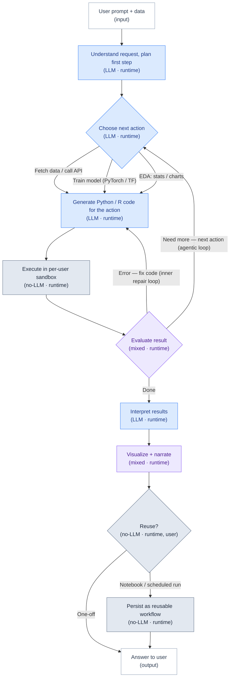

*Two nested loops are collapsed into the cycle above: an **inner repair loop** (a runtime error sends the code back to "Generate" to be fixed and re-run) and an **outer agentic loop** ("need more" returns to "Choose next action" for the next step). The cycle runs many times — often several steps — before "Done"; it is not a single pass, and the three action types are choices made per pass, not one-time exits. Julius doesn't publish its exact control flow, so the loop structure is inferred from its documented auto-debug behavior and reviewer observations of multi-step runs.*

**Compact view (slide-friendly):**

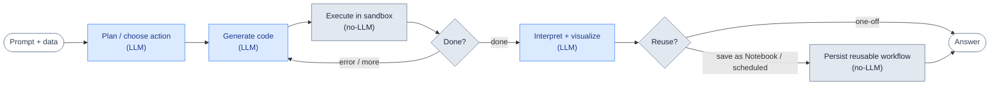

**Decomposition (Q1).** User- or agent-defined step plans / notebook cells. More a *guided plan executor* than an autonomous decomposer — you (or a Custom Agent's instructions) provide the steps.

**Ordering (Q2).** Plan/notebook order, or the agent follows a custom step plan.

**State / memory.** Notebooks persist; Custom Agents carry a knowledge base; Scheduled Runs persist analyses; per-user sandboxed storage, erased on delete.

**Where AI/LLM is used.** LLM plans steps, writes Python/R, and interprets results, combining Julius's own models with frontier LLMs (GPT/Claude/Gemini on paid tiers). **Code execution is deterministic; ML training uses libraries (PyTorch/TF), not the LLM.**

**Pros.** The only tool here explicitly covering external APIs + ML training + EDA in one session; R support. **Cons.** Chat-first (the reasoning can be opaque — "how did it get that?"); credit pricing; not built for hardened multi-agent orchestration.

**Fitment.** The best commercial analog of the whole thing you're building. Study **Custom Agents + Scheduled Runs** as the product shape for "save a plan, parameterize it, re-run it" — i.e. turning a one-off plan into a reusable, schedulable workflow.

**References.** https://julius.ai/ · workflows https://julius.ai/features/workflows · custom agents https://julius.ai/product/custom-agents

---

## 3. DeepAnalyze-8B

**Snapshot.** Open-source (model + code + data) research system from Renmin University — the self-described *first agentic LLM for autonomous data science*, end-to-end from raw data to analyst-grade report. Built on DeepSeek-R1-0528-Qwen3-8B. The architectural opposite of the others: there's **no external workflow** — the model itself is trained to plan, act, observe, and iterate.

**Architecture & components.**
- **Five action tokens** the model emits to run its own loop: `<Analyze>` (plan/reason/reflect/self-verify), `<Understand>` (inspect tables/docs/databases), `<Code>` (write Python), `<Execute>` (run code, collect environment feedback), `<Answer>` (final output). The LLM vocabulary is extended with these special tokens.
- **Curriculum-based agentic training** — stage 1 single-ability fine-tuning (reasoning/understanding/code via long CoT), stage 2 multi-ability agentic RL (GRPO) to integrate skills in real environments.
- **Data-grounded trajectory synthesis** — a questioner/solver/inspector multi-agent protocol generates high-fidelity training trajectories; an inspector audits them against checklists.
- **Datasets/benchmarks** — DataScience-Instruct-500K; evaluated on DSBench, DABStep, DS-1000, TableQA, etc. Supports up to ~30 reasoning rounds.

**Workflow after a user request.** (this is the actual inference loop — Algorithm 1)

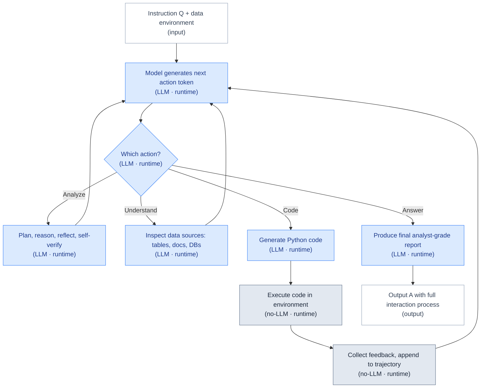

*(Loop continues — up to ~30 rounds — until an `<Answer>` token is generated. A hard rule inserts `<Execute>` after every `<Code>`, so act→observe is trained in.)*

**Compact view (slide-friendly):**

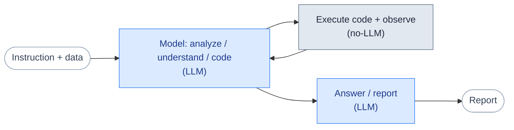

**Decomposition (Q1).** Internal to the model — `<Analyze>` lays out the plan; curriculum training teaches it to compose abilities. No external planner.

**Ordering (Q2).** Emergent from autoregressive generation: the next action is conditioned on the accumulated trajectory; the forced `<Execute>`-after-`<Code>` rule and RL rewards shape valid sequencing.

**State / memory.** The growing multi-round trajectory (bounded by the model's context window) plus the **filesystem** — files written persist and are read back. No external memory service.

**Where AI/LLM is used.** Everything — the LLM *is* the agent (analyze/understand/code-gen all in-model). Only code execution and file I/O are deterministic (handled by the environment).

**Pros.** Fully open (weights + code + ~500K-example instruction dataset); an 8B model reported to be competitive with agents built on larger proprietary LLMs; no external scaffolding to maintain. **Cons.** Research artifact — no RBAC/cost-control/SLA; production robustness is unproven; state bounded by context window; you run the environment.

**Fitment.** If you'd ever *train/fine-tune* a planner instead of prompting one, this is your blueprint, and the 500K instruction set is a real asset. Also the strongest evidence you don't need a frontier-size model for the planner. Its forced act→observe rule is a good reliability idea even in a prompted system.

**References.** project https://ruc-deepanalyze.github.io/ · paper https://arxiv.org/abs/2510.16872 · code https://github.com/ruc-datalab/DeepAnalyze · model https://huggingface.co/RUC-DataLab/DeepAnalyze-8B

---

## 4. Agno Dash

**Snapshot.** Open-source (built on the **Agno** framework) self-learning data agent, explicitly modeled on OpenAI's internal data agent. The cleanest open codebase that separates *planning* (a Leader) from *execution* (Analyst/Engineer specialists) and persists corrections as reusable learnings. Runs in Slack, terminal, or the AgentOS web UI over PostgreSQL.

**Architecture & components.**
- **Team (coordinate mode):** **Leader** coordinates + answers; **Analyst** introspects schema and writes **read-only** SQL on the `public` (company) schema; **Engineer** builds reusable views in the agent-managed `dash` schema.
- **6 layers of context:** (1) schema/relationships, (2) human annotations/business logic, (3) proven SQL patterns, (4) institutional knowledge via MCP/docs, (5) machine-discovered error patterns, (6) live runtime introspection. Retrieved at runtime via **PgVector hybrid search** — *the Leader gets learnings; specialists get knowledge.*
- **Self-learning:** success → save validated query as **Knowledge**; failure → **Agno Learning Machine** diagnoses, fixes, and saves a **Learning** so the mistake isn't repeated. Improves with no fine-tuning/retraining.
- **Guardrails (infrastructure, not prompts):** Analyst connects with `default_transaction_read_only=on` (Postgres rejects writes); Engineer writes scoped to `dash` schema via a SQLAlchemy event listener; AgentOS JWT/RBAC, sessions, traces.

**Workflow after a user request.**

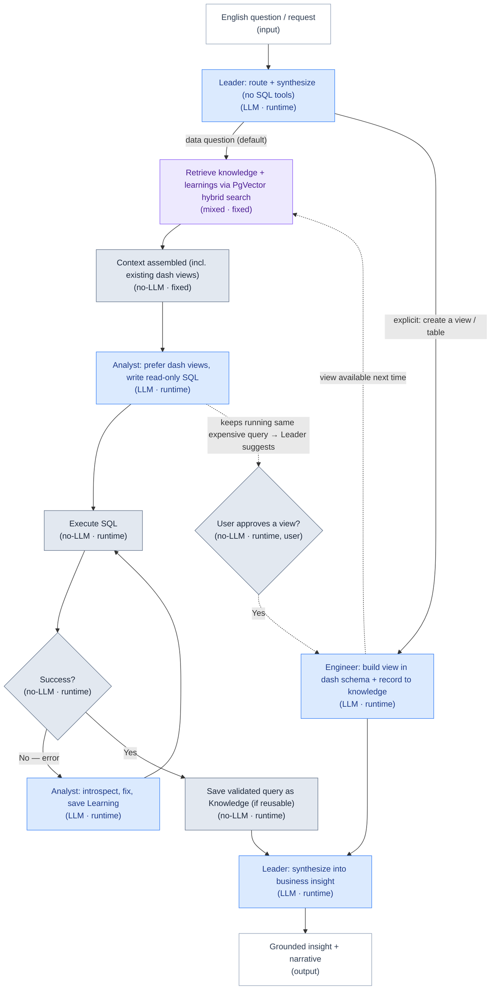

*Verified against the Leader's actual system prompt (`dash/instructions.py`). An explicit "create a view/table" request routes straight to the **Engineer** (solid); everything else **defaults to the Analyst**. The **proactive** path (dotted) is not a counter — the Leader's "Proactive Engineering" instruction tells it, in natural language, that when the Analyst keeps re-running the same expensive query it should **suggest a view to the user**, who approves it. So pattern-"detection" is LLM judgment, and view-building is **user-approved, not autonomous**. Once built, the view is recorded to knowledge and the Analyst prefers it next time — the compounding loop, which runs across requests. The solid error loop is the Analyst's own self-learning (introspect → fix → save Learning → retry); after two failures the Leader instead asks the Engineer to introspect.*

**Compact view (slide-friendly):**

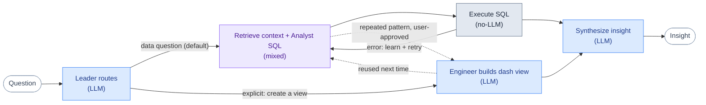

**Decomposition (Q1).** The Leader routes each question to the Analyst by default, and *separately* triggers the Engineer to build a reusable asset when it detects a recurring pattern across queries (not a per-request either/or choice).

**Ordering (Q2).** The Leader sequences; the standout is the **self-learning loop** — failed steps become permanent learnings, which is effectively *replanning memory* that compounds over time.

**State / memory.** PostgreSQL holds **Knowledge** (curated/validated) and **Learnings** (discovered); sessions/traces live in AgentOS. Memory is the context layer, not model weights — "learning compounds for free" without touching the base model.

**Where AI/LLM is used.** LLM reasons about intent, generates grounded SQL, and diagnoses/fixes errors; a separate embedding model powers hybrid retrieval. SQL execution, read-only enforcement, and schema isolation are deterministic infrastructure.

**Pros.** Clear planner/executor separation; concrete replanning-as-memory pattern; DB-level (not prompt-level) guardrails. **Cons.** Postgres-centric; tightly coupled to Agno / os.agno.com; steep context-curation setup; an operational workflow to adopt, not a drop-in library.

**Fitment.** Read this to copy two things directly: **planner/executor separation** (your exact split) and a **replanning loop that persists corrections** as reusable learnings — plus the idea that data-access guardrails belong in infrastructure, not in prompts.

**References.** repo https://github.com/agno-agi/dash · author writeup https://www.ashpreetbedi.com/articles/dash · product https://www.agno.com/ai-agents/self-learning-data-agent · Agno https://github.com/agno-agi/agno

---

## 5. Airflow 3 + Astronomer Otto

**Snapshot.** The **execution backbone**, not a data planner. Apache Airflow 3 is the deterministic orchestrator (DAGs, scheduling, retries, HITL); the **Common AI Provider** / **airflow-ai-sdk** let you put LLM and agent calls *inside* DAGs as named, logged, retryable tasks; **Astronomer Otto** is a data-engineering agent that authors DAGs, diagnoses failures, and plans upgrades. Open source (Apache 2.0) core; Otto is an Astro product.

**Architecture & components.**
- **Airflow 3 engine** — DAG versioning, **event-driven scheduling**, **human-in-the-loop operators**, remote execution, asset-aware scheduling.
- **Common AI Provider (`apache-airflow-providers-common-ai`)** — built on **Pydantic AI**, 20+ model providers; decorators **`@task.llm`** (typed LLM call), **`@task.agent`** (agent loops over tools until done), **`@task.llm_branch`** (LLM-driven control flow); **SQLToolset**; **AIBudget** cost caps per task/DAG/team; every LLM call logs tokens + tool calls to the metadata DB. **Dynamic Task Mapping** turns one request into a fan-out/fan-in of independently retryable LLM tasks.
- **Astronomer Otto** — reads task logs, traces dependency chains, checks run history; returns root cause + proposed fix; runs DAGs locally to catch failures pre-deploy; produces fleet-wide upgrade plans. **Model-agnostic via Astronomer's LLM Gateway.** **Otto Memory stored in git** (transparent, versionable, correctable).
- **`astronomer/agents` plugin** — Airflow **MCP server** + installable skills for 25+ coding agents (Claude Code, Cursor, etc.).

**Workflow after a user request.**

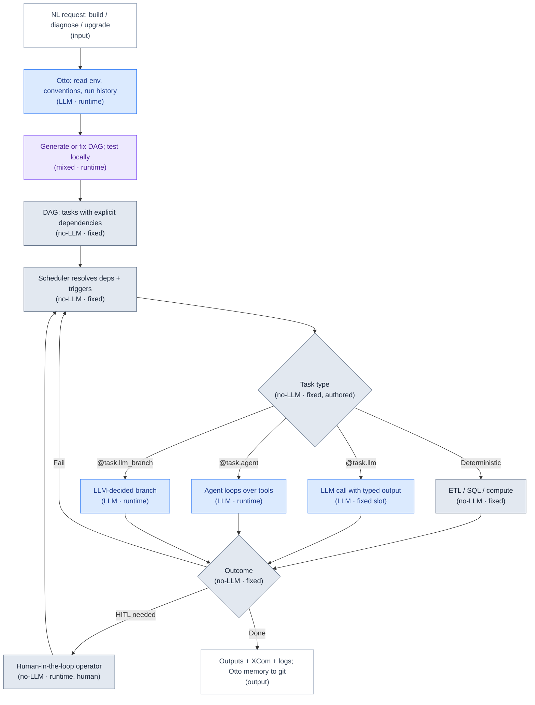

*Two phases in one picture: everything up to the **DAG** is build-time authoring (Otto — optional and human-invoked); everything from the **Scheduler** onward is the deterministic runtime engine, which involves no LLM and no Otto unless a task type explicitly calls one. The `Fail → Scheduler` and HITL edges are Airflow's own retry/approval loops, not Otto replanning.*

**Compact view (slide-friendly):**

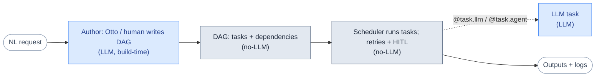

**Decomposition (Q1).** Not an autonomous NL decomposer at the engine level — *you* or an authoring agent (Otto) define tasks. Within a DAG, `@task.agent` can decompose its own sub-steps over tools, and Dynamic Task Mapping fans a request into parallel tasks.

**Ordering (Q2).** **The DAG *is* the ordering** — explicit dependencies, retries, event triggers, parallelism. This is the deterministic ordering layer your emergent LLM plan should *compile down to*.

**State / memory.** XComs + metadata DB for run state and full agent/LLM logs (auditable after the fact); **Otto Memory in git** for team conventions and corrections.

**Where AI/LLM is used.** The **core engine has no LLM**. LLMs enter only through (a) AI-SDK / Common-AI tasks you add, and (b) Otto (DAG authoring, failure diagnosis, upgrade planning). Scheduling, dependency resolution, retries, and execution are all deterministic.

**Pros.** Mature, deterministic ordering + retries + observability + HITL; broadest operator ecosystem; AI now native (typed outputs, cost caps, per-task logging). **Cons.** Heavy if self-hosted; not designed to *decompose* NL on its own; Otto is Astro-tied (though the OSS pieces aren't).

**Fitment.** Strong candidate for the layer that **runs your generated plan**. The pattern to adopt is explicit: planner LLM emits a plan → **materialize it as an Airflow DAG** (or AI-SDK agent tasks) → inherit retries, observability, HITL, and per-task cost caps. Note Astronomer's own thesis — *"workflows then agents"*: reliable LLM-in-workflow first, autonomous agent choreography only when needed.

**References.** Airflow/Astronomer — https://www.astronomer.io/ · AI SDK https://github.com/astronomer/airflow-ai-sdk · Common AI Provider https://airflow.apache.org/blog/common-ai-provider/ · agents/MCP https://github.com/astronomer/agents · Otto https://www.astronomer.io/blog/introducing-otto-the-only-data-engineering-agent-built-for-airflow/

---

## 6. Hermes Agent (Nous Research)

**Snapshot.** Open-source (MIT) **general-purpose** personal agent — native app for macOS/Windows/Linux plus a terminal app — by Nous Research. Not a data-analytics product, but its *substrate* mechanisms (subagent delegation, persistent skill-memory, multi-backend sandboxing, multi-model routing) are exactly the pieces your build needs underneath the data layer.

**Architecture & components.**
- **Multi-surface, one memory** — Telegram, Discord, Slack, WhatsApp, Signal, Email, CLI; a single agent + shared memory across every surface.
- **Persistent memory + auto-generated skills** — learns your projects, auto-generates reusable skills, "never forgets how it solved a problem."
- **Subagent delegation** — isolated subagents, each with its own conversation, terminal, and Python RPC scripts, for "zero-context-cost pipelines."
- **Isolated sandboxing** — five backends (local, Docker, SSH, Singularity, Modal) with container hardening + namespace isolation.
- **NL scheduling** — natural-language scheduling for unattended reports/backups/briefings via a gateway.
- **Tools + models** — web search, browser automation, vision, image generation, TTS; **multi-model reasoning** over 300+ models via **Nous Portal**.

**Workflow after a user request.**

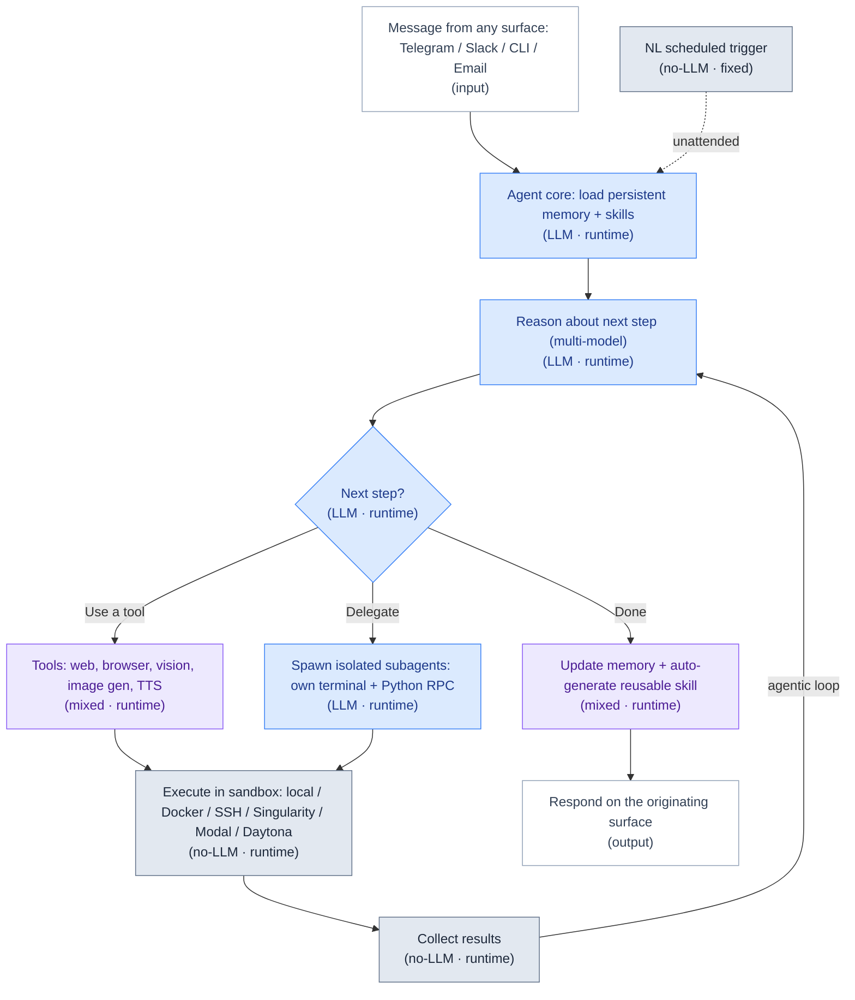

*The **agentic loop** (collect results → reason about the next step) runs until the agent decides "Done" — a single tool or subagent call is one pass, not the whole task. The memory update and skill generation happen once, on completion.*

**Compact view (slide-friendly):**

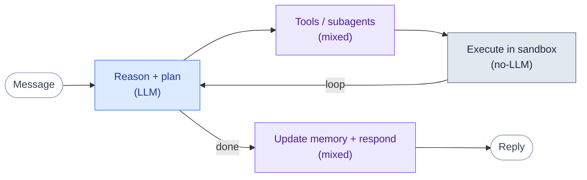

**Decomposition (Q1).** Subagent delegation — the parent decomposes work and spawns isolated children (supervisor-style), each with its own context/terminal/RPC.

**Ordering (Q2).** LLM-driven within a session; NL scheduling sequences unattended runs. No deterministic/symbolic planner.

**State / memory.** The standout — **persistent cross-surface memory** plus **auto-generated skills** that accumulate as reusable capabilities (a generalized version of Agno's learnings / Otto's git memory).

**Where AI/LLM is used.** LLM-driven throughout (planning, subagent reasoning, tool/web/browser use, skill generation), with **multi-model routing** across many models. Sandbox execution, the scheduling gateway, and subagent RPC plumbing are deterministic.

**Pros.** Open MIT; strong on the substrate concerns you'll hit anyway — subagent isolation, multi-backend sandboxing, persistent skill-memory, multi-model routing. **Cons.** General-purpose — no data semantic layer, no warehouse-native governance, no EDA/training specialization; planning is LLM-emergent, not deterministic.

**Fitment.** Not your data planner, but a useful **reference (possibly a base) for the execution substrate** — specifically its *subagent-with-own-terminal-and-RPC* delegation (your zero-context-cost parallel execution), its *auto-generated skills* memory (your replanning/learning loop), and its *five-backend sandboxing* (your safe code-execution layer).

**References.** https://hermes-agent.nousresearch.com/ · docs https://hermes-agent.nousresearch.com/docs · repo https://github.com/NousResearch/hermes-agent

---

## 7. Omnigent (Databricks)

**Snapshot.** Open-source (Apache 2.0), **alpha** **meta-harness** from Databricks (published to GitHub June 13, 2026) — a layer *above* coding agents (Claude Code, Codex, Cursor, Pi, OpenAI Agents/Claude SDK, custom) for composition, control, and collaboration. **Not a data agent**: it doesn't decompose or order data tasks; it governs the agents that do. It can use a **Databricks workspace as a model provider** (via the `databricks` extra), but you bring/pay for your own models and inference.

**Architecture & components.**
- **Runner + server split** — a *runner* wraps any agent in a sandboxed session behind a uniform API; a *server* provides policies + sharing and exposes every session over terminal, app, and web (local web UI at `localhost:6767`). CLI installs as `omnigent`/`omni`.
- **Uniform API** wrapping terminal agents + SDKs — swap Claude Code ↔ Codex ↔ Cursor ↔ Pi with one-line changes; compose multiple harnesses (and subagents on different harnesses) via YAML.
- **Stateful contextual policies** — enforce cost budgets (soft warning thresholds + hard `max_cost_usd` cap) and permissions at the meta-harness layer (not via prompts), tracking session state for context-dependent decisions rather than simple allow/deny.
- **Omnibox OS sandbox** — built by Databricks' security team; locks down filesystem access and intercepts/transforms network requests with kernel-level enforcement (bubblewrap + seccomp on Linux, Seatbelt on macOS). Example: the agent never sees your GitHub token — it's injected only in the egress proxy on approved requests.
- **Live collaboration** — share a running session via URL; teammates see messages, subagents, terminals, and files in sync and can comment/issue commands.
- **Example agents** ship with the repo (e.g. *Polly*, a multi-agent coding orchestrator that delegates to sub-agents in parallel git worktrees and cross-routes reviews; *Debby*, dual-model side-by-side).

**Workflow after a user request.**

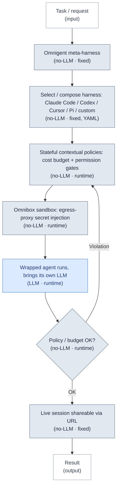

*The wrapped agent runs its own internal reasoning loop (hidden inside one node); Omnigent's loop is the **policy-enforcement** cycle — it evaluates cost/permission against the agent's actions and blocks or allows, rather than doing any task reasoning itself.*

**Compact view (slide-friendly):**

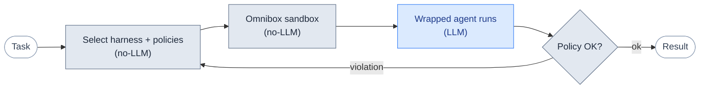

**Decomposition (Q1) / Ordering (Q2).** Neither — it composes and governs sub-agents; the wrapped agents do any decomposition/ordering.

**State / memory.** Per-session sandbox state; policy state is stateful/contextual across the session.

**Where AI/LLM is used.** Omnigent itself calls **no LLM for data work** — it wraps agents that bring their own models. Its policy/budget/sandbox logic is deterministic infrastructure over their token usage and OS access.

**Pros.** Clean control plane — swap models/harnesses, enforce cost/permission limits, sandbox OS access, collaborate live; open Apache 2.0. **Cons.** Alpha — enterprise RBAC, SSO/identity, and hardened audit trails are on the roadmap, not yet shipped; irrelevant unless you're running multiple agents/harnesses; not a data tool.

**Fitment.** Only relevant **if your executor spawns multiple specialized sub-agents** and you need cost/permission guardrails + sandboxing + collaboration across them. A sibling to Airflow (control plane), not to the data agents. Conceptual peers: LangGraph supervisor graphs, CrewAI, AutoGen.

**References.** blog https://www.databricks.com/blog/introducing-omnigent-meta-harness-combine-control-and-share-your-agents · repo https://github.com/omnigent-ai/omnigent · https://omnigent.ai/

---

## 8. Side-by-side & what to borrow

| System | Tier | Decomposition (Q1) | Ordering (Q2) | Trains models? | Standout to steal |
|--------|------|--------------------|---------------|----------------|-------------------|
| Oracle DS Agent | A | Lifecycle skeleton | Lifecycle + scope catalog | **Yes (classical, in-DB)** | Interactive→autonomous escalation |
| Julius AI | A | Notebook/agent step plan | Plan/notebook order | Yes (PyTorch/TF) | Save-plan-as-reusable-workflow |
| DeepAnalyze-8B | A | In-model `<Analyze>` | Autoregressive act→observe | Yes (end-to-end) | Forced execute-after-code; trainable planner |
| Agno Dash | A | Leader delegates | Leader + self-learning loop | No (SQL) | Planner/executor split + learnings-as-memory; guardrails in infra |
| Airflow 3 / Otto | B | DAG / `@task.agent` | **DAG dependency graph** | Orchestrates | Compile the plan to a DAG; per-task cost caps + HITL |
| Hermes Agent | C | Subagent delegation | LLM-driven + scheduling | No (general) | Subagent-with-RPC isolation; auto-generated skills |
| Omnigent | C | n/a (governs) | n/a (policies) | n/a | Cost/permission policies + OS sandbox over multiple agents |

**The composite blueprint these seven imply for your build:**

1. **Planner/executor separation** with the planner emitting typed subtasks — *Agno Leader, Genie supervisor*.
2. **Interactive→autonomous** intent/ambiguity handling — *Oracle*.
3. **Reusable, parameterized, schedulable plans** — *Julius notebooks, Airflow DAGs*.
4. **Forced act→observe + reflection loops** for reliability — *DeepAnalyze, Agno*.
5. **Compile the emergent LLM plan to a deterministic DAG** for ordering, retries, HITL, and per-task cost caps — *Airflow 3*.
6. **Persist corrections as first-class, versioned memory** (learnings/skills) so the system improves without retraining — *Agno, Otto, Hermes*.
7. **Reserve the LLM for reasoning/codegen; keep execution, model-training, scheduling, and guardrails deterministic** — *every system here draws this boundary; the system that trains models (Oracle; and Pecan in the companion landscape doc) uses classical ML, not the LLM*.
8. **Add a meta-harness only if you go multi-agent** — *Omnigent / LangGraph*.

---

*Provenance: details from vendor docs, engineering blogs, and open repos as linked per system. DeepAnalyze benchmark claims and Genie-style accuracy figures are author/vendor-reported, not independently verified. Product features and links change — verify before relying on specifics.*
